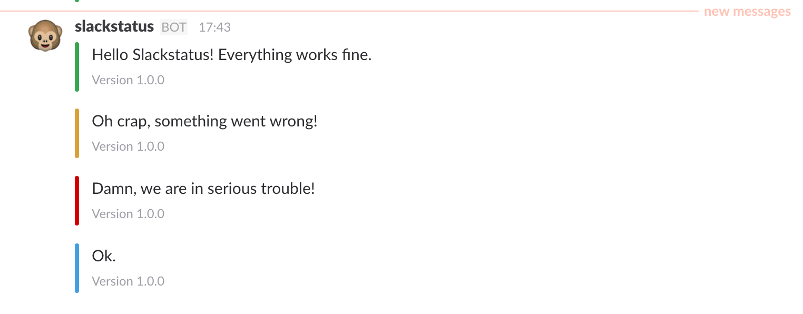

# slackstatus [](https://godoc.org/github.com/pteich/slackstatus)
Simple CLI tool and Go library to post formatted status messages to a Slack channel :tada:



## Usage as CLI tool

Slackstatus is available as pre-built binaries for macOS, Linux, FreeBSD and Windows on the [release page](https://github.com/pteich/slackstatus/releases).

```shell
slackstatus "message body" --webhook=https://hooks.slack.com/services/XXXX --color=good --chanel=status --user=slackstatus --footer="V1.0.0" --iconemoji=":monkey_face:"
```

You can also pipe your message text from another output:
```shell
echo "message text" | slackstatus --color=good
```

All flag values can also be pre-set in a config file `.slackstatus.yml` in the current directory or in your `$HOME` like so:
```yaml
webhook: https://hooks.slack.com/services/XXXX
user: slackstatus
channel: status
footer: V1.0.0
iconemoji: :monkey_face:
```

It is also possible to provide a specific path to your config file as `--config=/path/to/config`.

Get help on all available flags:
```shell
slackstatus --help
```

## Usage as Go library
```go
package main

import "github.com/pteich/slackstatus"

var slackmsg = slackstatus.Message{
	WebhookURL: "https://hooks.slack.com/services/XXXX",
	Username: "slackstatus",
	Channel: "#status",
	IconEmoji: ":monkey_face:",
	Footer: "Version 1.0.0",
}

func main() {

	slackmsg.Send("Hello Slackstatus! Everything works fine.", slackstatus.COLOR_GOOD)
	slackmsg.Send("Oh crap, something went wrong!", slackstatus.COLOR_WARNING)
	slackmsg.Send("Damn, we are in serious trouble!", slackstatus.COLOR_DANGER)
	slackmsg.Send("Ok.", "#439FE0")
  
}
```
